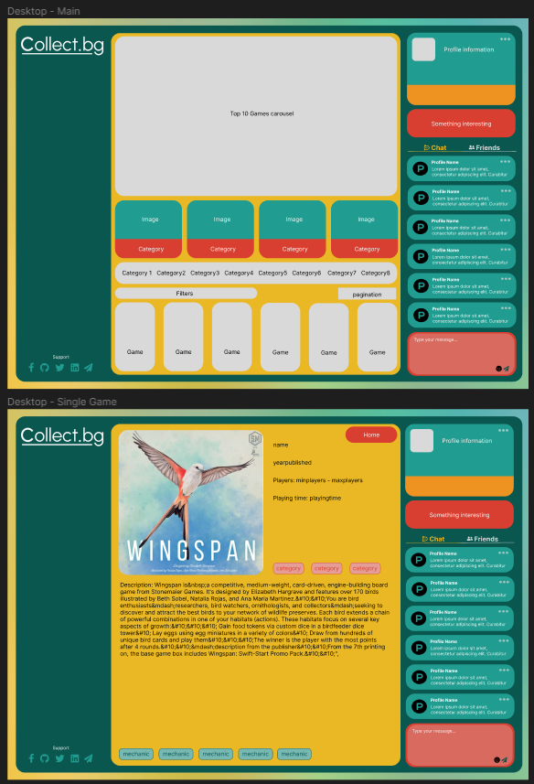
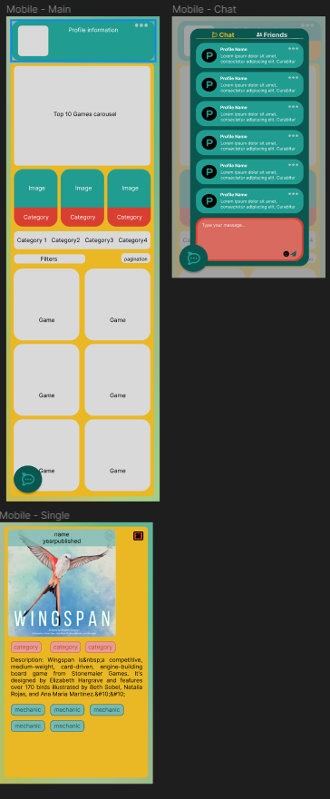
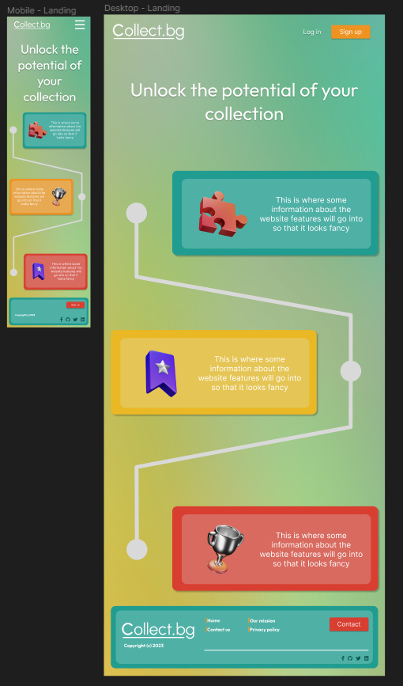
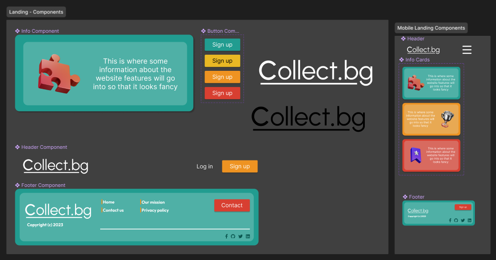
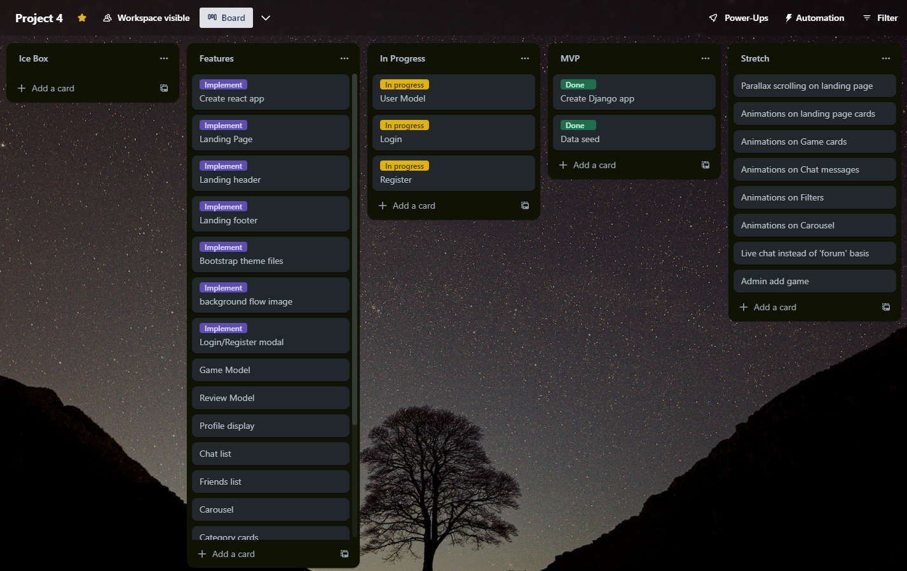

# Collect.bg

Collect.BG is a board-game collection website where users can send chat messages, follow other users and display their board game collections.

## Deployment link

[Live link to project](http://collect-bg-229e9688a986.herokuapp.com/)

## Overview

I was given 12 days to complete a react based application that would consume a Django/Postgres API in a solo project.

## Technologies used

### Tech
HTML, CSS, Javascript, SASS, Django, PostgresSQL, React, Node.JS, Bootstrap React

### Design
Trello, Figma, TablePlus, Postman, Quick Database Diagrams

## Brief

### Technical Requirements

You must:

* **Build a full-stack application** by making your own backend and your own front-end
* **Use a Python Django API** using Django REST Framework to serve your data from a Postgres database
* **Consume your API with a separate front-end** built with React
* **Be a complete product** which most likely means multiple relationships and CRUD functionality for at least a couple of models
* **Complex Functionality** complex functionality like integrating a 3rd party API or using a particularly complex React Component would mean that the CRUD and multiple relationships requirement can be relaxed, speak to your instructor if you think this could be you.
* **Implement thoughtful user stories/wireframes** that are significant enough to help you know which features are core MVP and which you can cut
* **Have a visually impressive design** to kick your portfolio up a notch and have something to wow future clients & employers. **ALLOW** time for this.
* **Be deployed online** so it's publicly accessible.

## Planning

I initially created a wireframe using Figma, picking out colour palettes and themes and drafting initial components. I then used an online pattern generator to create a background image and found icons that matched. I then wireframed the mobile and desktop landing pages, main views and chat modal for mobile. 

After wireframing I mapped out tasks into a trello board to organise the project

I then mapped out my database into a simple visualiser to view how the data will be structured

## Build process

I began by creating my logo and downloading my icon assets then searching for a smaller database as the original API I was going to use was very restrictive and has over 11,000 board games. I found a subset of 500 games and used python to assemble the data into a JSON file. I then used python scripts to trim and reshape the data into a seed file for Django.

[Import script 1](./README/import-script-1.PNG)
[Import script 1](./README/import-script-2.PNG)

After reshaping the seed data I started working on the landing page, framing the logo, buttons and footer before moving onto the games page as the style for the main section on the landing needed more refinement.

[Landing page](./README/landing-day2.PNG)

I created the three column view, putting the top 10 hottest games by using an API request to board game geek and linking users to their pages. The central column was intended for the main display of games, using a modal to show more descriptions and the right column for chat, profile and following other users collections.

[Desktop main](./README/desktop-day2.PNG)
[Mobile main](./README/mobile-day2.PNG)

After finishing the main features of collections, chat and following users I decided to retheme the project using a simplified colour scheme and choice selections of colours to highlight UI elements.

- Desktop

[Desktop final main](./README/final-landing.PNG)
[Desktop final main](./README/final-main.PNG)
[Desktop final main](./README/final-collection.PNG)
[Desktop final main](./README/final-following.PNG)

- Mobile

[Desktop final main](./README/final-mobile.PNG)
[Desktop final main](./README/final-mobile-main.PNG)
[Desktop final main](./README/final-mobile-chat.PNG)

## Challenges

Initially the data was not in a format that was useful, it was quite abstract with some things like mechanics and categories in one long list and not separated into objects. I also needed to be able to list all mechanics and categories so I used python scripts to separate the data into separate seeds.

[Import script 1](./README/import-script-1.PNG)
[Import script 1](./README/import-script-2.PNG)

After initially attempting to load all 400 board games from the app on page load in an attempt to make further queries faster. This meant that after hosting on Neon/Heroku the request would timeout after 30 seconds meaning my app could not retrieve any data.
To fix this I changed my API views to support pagination and filtering, resulting in my app making more frequent but much smaller requests for data.

[Pagination]

## Wins

The data for the top 10 games is sent as an XML rather than a JSON so I used the package react-xml-parser to get the data
[react-xml-parser](https://www.npmjs.com/package/react-xml-parser)

I debounced the search bar input to prevent making too many API requests
[debounce](./README/debounce.PNG)
[use-debounce](https://www.npmjs.com/package/use-debounce)

## Key Learnings

Designing my board game collection website using Python and Django API has significantly boosted my confidence in these technologies. Python allowed me to express my ideas seamlessly, making the coding process both enjoyable and efficient. Django's rest_framework  provided a structured approach to building my web application enabling me to create robust interfaces for managing and displaying my board game collection data. PostgreSQL played a crucial role in my app by providing a scalable database solution, ensuring efficient  retrieval of data using prefetch_related.

Figma resulted in an excellent basis for my concept allowing me to change my theming mid project without losing too much time. The ability to map out the structure for the app ahead of time proved invaluable in streamlining my design processes.

## Future Improvements

- Change chat function to use a web socket rather than re-querying the database to update

- Improve speed of server requests by changing away from Neon hosting

- Add ability for admins to add more games, expand the number of games in the database

